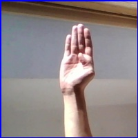
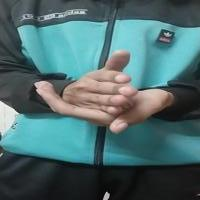

# Crazy Blocks ASL WebGL Demo
 A simple demo game that uses ASL signs as user input. It builds on the project described in [Jason Weimann's Beginner Unity3D Tutorial](https://www.youtube.com/watch?v=8rdfcq-jePw).

### Live Demo: [https://cj-mills.github.io/Crazy-Blocks-ASL-WebGL-Demo/](https://cj-mills.github.io/Crazy-Blocks-ASL-WebGL-Demo/)

<h3>Input Reference</h3>
 

| Input    | Image                                              |
| --------- | ------------------------------------------------------------ |
| Move Up        |  |
| Quit      |  |

https://user-images.githubusercontent.com/9126128/174238091-2fcaf0ca-4bd3-4b12-b00e-d3bf2d42b64a.mp4

